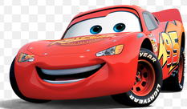

## Tarun's Page

Go to my [Github account](https://github.com/tarunja1ks) !!
It includes many cool projects that you should check out. 

## Overview of Hacks, Study and Tangibles
Blogging in GitHub pages is a way to learn and code at the same time. 
- Plans, Lists, [Scrum Boards](https://clickup.com/blog/scrum-board/) help you to track key events, show progress and record time.  Effort is a big part of your class grade.  Show plans and time spent!
- [Hacks(Todo)](https://levelup.gitconnected.com/six-ultimate-daily-hacks-for-every-programmer-60f5f10feae) enable you to stay in focus with key requirements of the class.  Each Hack will produce Tangibles.
- Tangibles or [Tangible Artifacts](https://en.wikipedia.org/wiki/Artifact_(software_development)) are things you accumulate as a learner and coder. 

## My Hobbies

Some things I like to do for fun include coding, basketball, and more. I enjoy play basketball in my backyard or friends in the park. I cannot dunk like in the picture yet, but I hope to do so in the future. I also have some experience in coding competitvely in hackathons and competitive programing competitions. I code mainly in Python and Java. I also like to eat ice cream, which is in my freeform picture. Another one of my hobbies, is music as I enjoy listening to many songs on Spotify, which is indicated by the app logo in my freeform. 

## Youtube Channel
Subscribe to my [Youtube Chanel](https://www.youtube.com/@tarunjaikumar9058/featured) !!

## More About Me

My Favorite Artist(Music) is DJ Khaled. 

My faovrite Sport is basketball currently.

My favorite coding language is Java as it was my first language and I am very use to it. 

My favorite or preffered browser is chrome as I like the extensions and it is faster for me. 

My favorite movie is Cars(the whole series mainly) and in the series my favorite character is Mater as he has fun personality.
